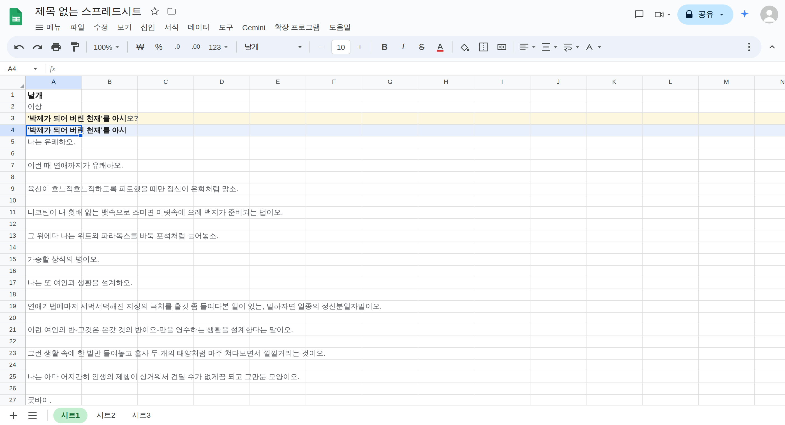
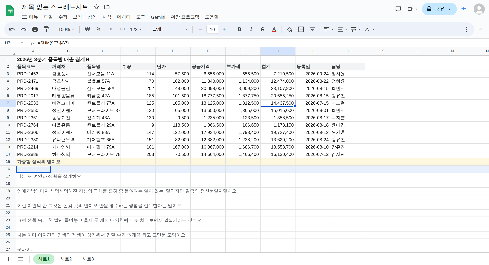

# 시트형 타자연습 (Sheet Typing Practice)

스프레드시트 화면 그대로 생긴 **긴글 타자연습**입니다.
설치도 빌드도 필요 없습니다. `index.html` 을 열면 바로 실행됩니다.



---

## 실행 방법

- **바로 열기** : `index.html` 더블클릭
- **GitHub Pages** : 저장소 `Settings → Pages → Branch` 를 선택해 배포하면 링크로 공유할 수 있습니다.

브라우저만 있으면 되고, 별도 서버나 의존성 패키지가 없습니다.

---

## 시트 구성

| 시트 | 내용 |
|------|------|
| **시트1** | 기본 타자 연습 (긴글) |
| **시트2** | 원하는 글을 붙여넣는 곳 |
| **시트3** | 사용 방법 |

---

## 긴글 연습

글줄과 입력칸이 한 행씩 번갈아 놓입니다. 제목과 저자는 화면에만 표시되고 타자 대상이 아닙니다.

```
1행   날개                          ← 제목 (연습 대상 아님)
2행   이상                          ← 저자 (연습 대상 아님)
3행   '박제가 되어 버린 천재'를 아시오?   ← 글줄 (한 문장)
4행   [             입력칸             ]
5행   나는 유쾌하오.                   ← 글줄 (한 문장)
6행   [             입력칸             ]
```

- 지금 치는 글줄과 입력칸에는 색이 깔리고 글자가 굵게 나옵니다.
- 글자를 칠 때마다 글줄의 글자 색이 바뀝니다. (맞으면 검정, 틀리면 빨강)
- 문장이 길어 화면을 넘어가면 치는 위치를 따라 가로로 움직입니다.
- `Enter` : 다음 줄의 입력칸으로 이동
- `Space` : **줄을 끝까지 입력한 상태**라면 스페이스로도 다음 줄로 이동
- 마지막 줄까지 마치면 결과 창이 열립니다. `Enter` 로 닫습니다.

### 위장 기능

한 줄을 끝내고 `Enter` 를 누르면 그 줄의 **글과 입력한 글이 사라지고 업무용 표로 바뀝니다.**
바뀐 셀을 클릭하면 수식 입력줄에 함수가 보입니다.
연습을 이어갈수록 화면이 점점 평범한 업무 문서가 됩니다.

위장표는 **글 선택 도구 맨 아래**에서 두 가지 중에 고릅니다. 고른 값은 저장됩니다.

**매출 집계표** (일반 업무용, 기본값)

| 품목코드 | 거래처 | 품목명 | 수량 | 단가 | 공급가액 | 부가세 | 합계 | 등록일 | 담당 |
|---|---|---|---|---|---|---|---|---|---|
| PRD-2453 | 금호상사 | 센서모듈 11A | 114 | 57,500 | 6,555,000 | 655,500 | 7,210,500 | 2026-09-24 | 정하윤 |

**구입도서 신청목록** (도서관 수서용)

| 번호 | 서명 | 저자 | 출판사 | 주문권수 | 단가 | 합산가 |
|---|---|---|---|---|---|---|
| 1 | 하얼빈 | 김훈 | 문학동네 | 3 | 16,800 | 50,400 |
| 2 | 총, 균, 쇠 | 재레드 다이아몬드 | 문학사상 | 2 | 28,000 | 56,000 |

서명·저자·출판사는 실제로 있는 책 40권에서 가져오고(같은 책이 한 바퀴 돌기 전에는 다시 나오지 않습니다),
주문권수는 1~5권 사이에서 정해집니다. 합산가는 단가 × 권수로 맞아떨어집니다.

연습 도중에 바꿔도 **진행 상황은 그대로**이고, 이미 바뀐 줄만 새 표로 다시 그려집니다.



---

## 타임어택

`Ctrl + X` 로 시작합니다. 시작 **2초 뒤부터 글이 왼쪽에서 오른쪽으로 서서히 사라집니다.**
한 줄이 모두 사라지면 강제로 다음 줄로 넘어갑니다.

| 레벨 | 속도 | 설명 |
|------|------|------|
| 1단계 | 50타 | 분당 50타로 치는 사람이 충분히 따라갈 수 있는 속도 |
| 2단계 | 90타 | 보통 속도 |
| 3단계 | 150타 | 빠른 속도 |

| 키 | 동작 |
|----|------|
| `Ctrl + X` | 타임어택 시작 |
| `Ctrl + X` | 진행 중 다시 누르면 일시정지 / 계속하기 |
| `Esc` 또는 `[중단]` 버튼 | 중단하고 결과 보기 |

진행 중에는 화면 오른쪽 아래에 레벨 · 경과 시간 · 남은 줄과 함께
`일시정지` / `중단` 버튼이 있는 조작 바가 나타납니다.

---

## 연습할 글 고르기

툴바에서 원래 글꼴을 지정하던 자리(`기본값`)가 **글 선택 도구**입니다.
내장된 글과 시트2에 넣은 커스텀 글 중에서 고를 수 있습니다.

내장된 글

| 글 | 저자 | 분량 |
|----|------|------|
| 날개 | 이상 | 도입부 32줄 |
| 메밀꽃 필 무렵 | 이효석 | 도입부 29줄 |
| B사감과 러브레터 | 현진건 | 도입부 31줄 |
| 별 헤는 밤 | 윤동주 | 전문 32줄 |
| 애국가 | — | 12줄 |

글을 넣을 때 지킨 규칙

- **한 문장이 한 줄**입니다. 한 문장이 두 줄로 잘리지 않습니다.
  다만 시(별 헤는 밤)는 시행 자체가 한 줄이므로 원문의 행 나눔을 그대로 두었습니다.
- **한자는 본문에서 덜어냈습니다.** 키보드로 바로 칠 수 없기 때문입니다.
  (`소학교(小學校)` → `소학교`, `화중지병(畵中之餠)` → `화중지병`)
- 따옴표와 말줄임표도 키보드로 칠 수 있는 문자(`'` `"` `...`)로 적었습니다.
- 애국가는 국가이므로 작사가 칸을 비워 두었습니다.

### 내 글 넣기 (시트2)

시트2의 **아무 셀에나** 원하는 글을 붙여넣거나(`Ctrl+V`) 직접 입력하면
그대로 시트1의 연습 글이 됩니다.

- **셀 하나에 글 하나**가 통째로 들어갑니다. 붙여넣은 글을 줄로 쪼개지 않습니다.
- 셀을 여러 개 쓰면 글도 여러 개가 되고, 툴바의 글 선택 도구에서
  `커스텀 글 A1`, `커스텀 글 A2` … 처럼 셀 이름으로 골라 씁니다.
- 저장 용량을 생각해 **한 번에 5개까지**만 씁니다.
- 연습할 때는 **한 문장이 한 줄**이 되도록 자동으로 나뉩니다.
  (따옴표 안에서는 끊지 않고, 너무 긴 문장만 어절 단위로 더 나눕니다)
- 넣은 내용은 브라우저에 저장되어 다음에 열 때도 남아 있습니다.

### 여러 칸 선택과 지우기 (시트2)

| 조작 | 결과 |
|------|------|
| 셀을 끌기 | 끈 범위가 선택됩니다 |
| `Shift` + 클릭 / 방향키 | 시작점을 두고 범위를 넓힙니다 |
| 열 머리글 `A` `B` … 클릭 | 그 열 전체 |
| 행 머리글 `1` `2` … 클릭 | 그 행 전체 |
| 왼쪽 위 모서리 클릭 · `Ctrl+A` | 시트 전체 |
| `Delete` | 선택한 범위를 한 번에 비웁니다 |

선택한 범위는 수식 입력줄 왼쪽 이름 칸에 `A1:C4` 처럼 표시됩니다.

---

## 제목과 프로필

- **제목** : 문서 제목을 더블클릭하면 이름을 바꿀 수 있습니다. (기본값 `제목 없는 스프레드시트`)
- **프로필** : 오른쪽 위 프로필을 클릭하면 아이디(10자 이내)와 사진(10MB 이하)을 설정할 수 있습니다.
  올린 사진은 정사각형으로 잘라 저장합니다.

---

## 기록 계산 방식

- **타수** : 한글은 자모 단위로 셉니다. 겹자음·겹모음·겹받침과 대문자는 2타로 계산합니다.
  (`한글` = 6타, `값` = 4타)
  맞게 친 글자의 타수를 실제 걸린 시간으로 나눈 값입니다.
- **정확도** : 글줄과 입력한 글을 글자 단위로 맞춰 계산합니다.
  글자 수가 다르면 긴 쪽을 기준으로 삼습니다.
- **평균 타수 / 최고 타수 / 정확도 / 오타 / 소요 시간 / 완료한 줄** 을 결과 창에 보여줍니다.

---

## 화면 규칙

실제 스프레드시트처럼 동작하도록 다음을 지켰습니다.

- 셀 크기는 창 크기와 관계없이 **항상 고정** (가로 100px · 세로 21px). 좁아지면 가로로 스크롤합니다.
- 글자 크기는 툴바의 `− 10 +` 에서 **10 ~ 24pt** 로 바꿉니다.
  숫자 칸에 직접 입력하거나 위/아래 방향키로도 조절되고, 다음에 열 때도 유지됩니다.
  실제 시트처럼 글자가 커지면 행 높이도 같이 커집니다.
- 툴바(빠른 설정)는 창이 좁아지면 **세로 점 세 개(⋮)** 안으로 접힙니다.
  단, **글 선택 도구는 접히지 않고 항상 툴바에 남습니다.**
- `파일 · 수정 · 보기 …` 메뉴 줄은 창이 좁아지면 사라집니다.
- 어느 경우에도 줄바꿈으로 세로로 늘어나지 않습니다.

---

## 파일 구성

```
index.html          화면 구조 (상단바 · 툴바 · 수식 입력줄 · 시트 탭)
css/app.css         스타일 전체
js/texts.js         내장 긴글 목록
js/util.js          타수 계산 · 저장소 · 위장 데이터 생성
js/grid.js          시트 그리드 (고정 셀 · 선택 · 편집 · 붙여넣기)
js/chrome.js        제목 · 프로필 · 툴바 접기 · 팝업 공통
js/typing.js        타자 연습 엔진 (긴글 연습 + 타임어택)
js/app.js           시트1 · 시트2 · 시트3 구성과 연결
```

---

## 단축키 정리

| 키 | 동작 |
|----|------|
| `Enter` | 다음 줄로 이동 / 결과 창 닫기 |
| `Space` | 줄을 끝까지 입력했을 때 다음 줄로 이동 |
| `Ctrl + X` | 타임어택 시작 · 일시정지 · 계속하기 |
| `Esc` | 타임어택 중단, 팝업 닫기 |
| `Ctrl + V` | (시트2) 글 붙여넣기 |
| `Ctrl + A` | (시트2) 시트 전체 선택 |
| `Shift` + 방향키 | (시트2) 선택 범위 넓히기 |
| `Delete` | (시트2) 선택한 범위 비우기 |
